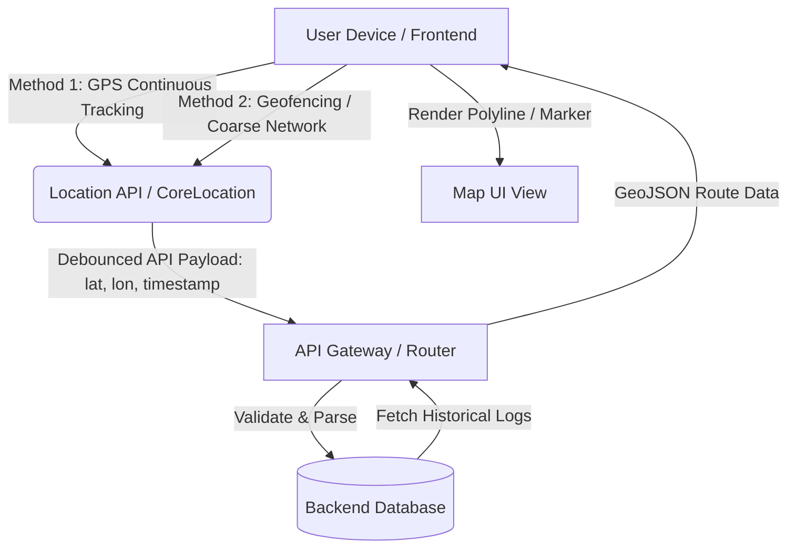

```mermaid
graph TD
    %% Fetching Layer
    A[User Device / Frontend] -->|Method 1: GPS Continuous Tracking| B(Location API / CoreLocation)
    A -->|Method 2: Geofencing / Coarse Network| B
    
    %% Transport Layer
    B -->|Debounced API Payload: lat, lon, timestamp| C[API Gateway / Router]
    
    %% Storage Layer
    C -->|Validate & Parse| D[(Backend Database)]
    
    %% Display Layer
    D -->|Fetch Historical Logs| C
    C -->|GeoJSON Route Data| A
    A -->|Render Polyline / Marker| E[Map UI View]
```
